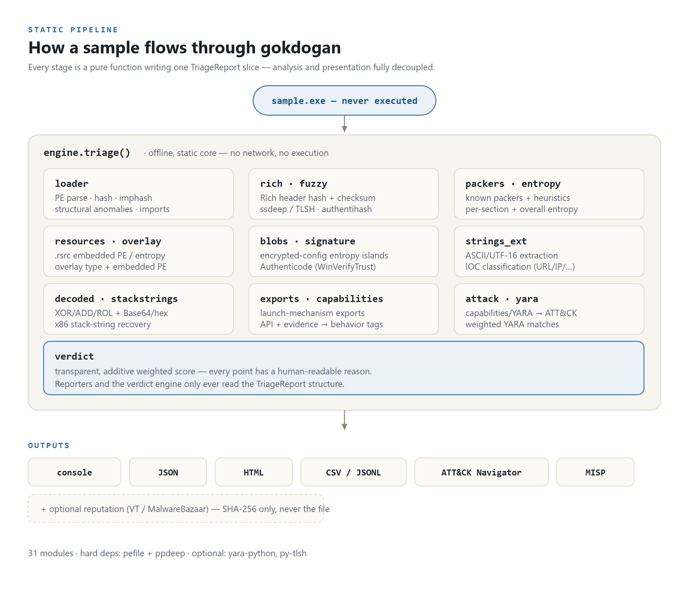
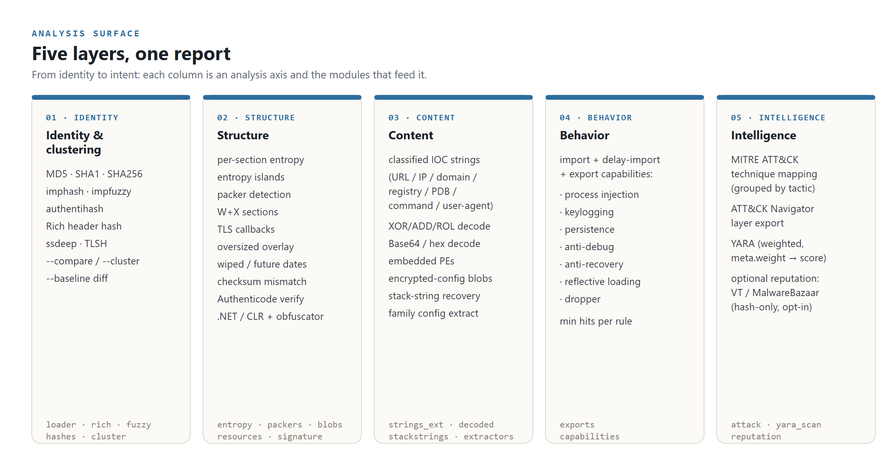
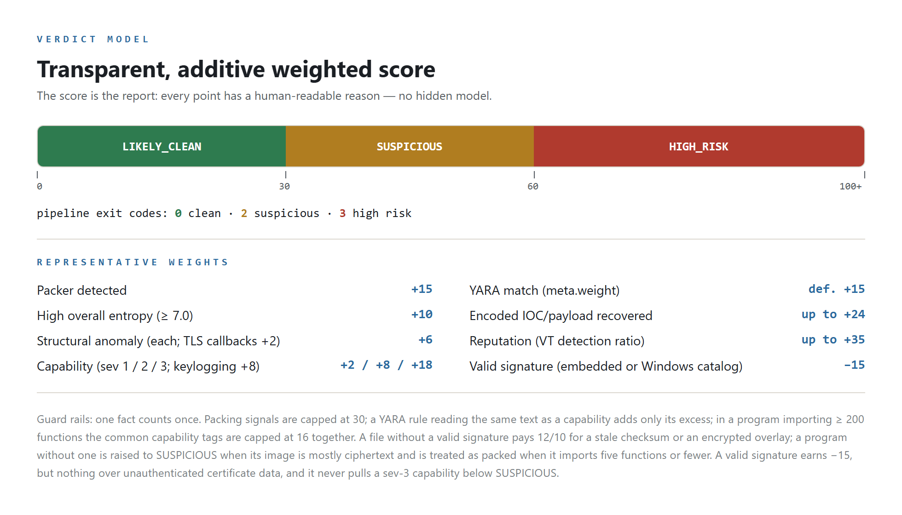

# gokdogan — Architecture Overview

*gökdoğan* is Turkish for the **peregrine falcon** — the fastest hunter in the
sky. The package and command are the ASCII `gokdogan`.

**Static PE malware triage engine.** Given a Windows executable, gokdogan
extracts static features — never executing the sample — and produces a
transparent, weighted verdict: `LIKELY_CLEAN`, `SUSPICIOUS`, or `HIGH_RISK`.

- **~5,200 lines** of Python across 31 focused modules
- **~4,300 lines** of tests · **345 tests** · real-binary integration suite
- False-positive benchmark ([`scripts/benign_sweep.py`](scripts/benign_sweep.py)): 2.2% of held-out benign files flagged, down from 12.7% at v0.5.2
- Hard deps: `pefile`, `ppdeep`, `dnfile` · optional: `yara-python`, `py-tlsh`

This document explains *how it is built and why*. For usage, see [README.md](README.md).

---

## 1. Design principles

The whole engine is organized around five decisions that keep it correct,
fast, and trustworthy for an analyst.

| Principle | What it means in the code |
|---|---|
| **Pure functions → dataclasses** | Every analyzer is a pure function over `bytes`/`pefile.PE` returning dataclasses ([`models.py`](gokdogan/models.py)). Analyzers never know about each other or the output format. Adding a stage = one module + one line in [`engine.py`](gokdogan/engine.py). |
| **Offline by default** | The `triage()` core never touches the network and never runs the sample. The single online feature (reputation) is opt-in, hash-only, and lives in the CLI layer — so the analysis core is safe on an air-gapped malware workstation. |
| **Auditable verdict** | The score *is* the report: every point carries a human-readable reason ([`verdict.py`](gokdogan/verdict.py)). There is no hidden model an analyst can't argue with. |
| **Calibrated against false positives, on one machine** | Weights were set by triaging a random sample of 2,888 installed PE files on one workstation and removing the causes of the verdicts benign software got ([`scripts/benign_sweep.py`](scripts/benign_sweep.py)), then checked on a second, held-out sample from the same machine. Capability rules need specific APIs, not just a count of generic ones; entropy islands only fire in writable sections; compressed media resources are recognised by their headers. |
| **Graceful degradation** | Missing YARA, missing rules, a corrupt resource tree, an unparseable import table — each becomes a note in the report, never a crash. |

---

## 2. Pipeline

<p align="center">
  
</p>

```
                          ┌──────────────────────────────────────────────┐
   sample.exe  ─────────▶ │                 engine.triage()              │
   (never run)            │                                              │
                          │  loader ─ hashes, imphash, sections,         │
                          │           anomalies, imports, delay-imports  │
                          │  rich   ─ toolchain hash + checksum          │
                          │  fuzzy  ─ ssdeep / TLSH                       │
                          │  packers ─ known names + heuristics          │
                          │  resources ─ embedded PEs, high-entropy       │
                          │  blobs  ─ encrypted-config entropy islands   │
                          │  strings_ext ─ classified IOC strings        │
                          │  decoded ─ XOR/ADD/ROL/base64/hex recovery    │
                          │  exports ─ launch-mechanism exports          │
                          │  capabilities ─ APIs+evidence → behavior tags│
                          │  attack ─ capabilities/YARA → MITRE ATT&CK    │
                          │  yara   ─ weighted rule matches              │
                          │  verdict ─ transparent weighted score        │
                          └───────────────────────┬──────────────────────┘
                                                  ▼
      console · JSON · HTML · CSV/JSONL · ATT&CK Navigator layer   (+ opt-in reputation)
```

Each stage writes one slice of a `TriageReport`; the reporters and the
verdict engine only ever read that structure. Presentation and analysis are
fully decoupled.

---

## 3. Module map (31 modules, by layer)

**Core**
- [`engine.py`](gokdogan/engine.py) — orchestrator; the entire `triage()` pipeline
- [`models.py`](gokdogan/models.py) — dataclasses shared by every stage
- [`loader.py`](gokdogan/loader.py) — PE parsing, hashes, imphash, structural anomalies, (delay-)imports

**Identity & clustering**
- [`fuzzy.py`](gokdogan/fuzzy.py) — ssdeep + optional TLSH; `--compare` similarity
- [`rich.py`](gokdogan/rich.py) — Rich header hash, `@comp.id` decode, checksum-tamper detection
- [`hashes.py`](gokdogan/hashes.py) — authentihash (signature-independent) + impfuzzy import hash
- [`cluster.py`](gokdogan/cluster.py) — `--cluster` union-find grouping of a dropzone
- [`baseline.py`](gokdogan/baseline.py) — `--baseline` diff of a sample vs a known-good reference

**Structure**
- [`entropy.py`](gokdogan/entropy.py) — Shannon entropy + thresholds
- [`packers.py`](gokdogan/packers.py) — known packer sections + structural heuristics
- [`blobs.py`](gokdogan/blobs.py) — encrypted-config entropy islands
- [`resources.py`](gokdogan/resources.py) — `.rsrc` walker: embedded PEs, high-entropy blobs
- [`overlay.py`](gokdogan/overlay.py) — overlay content: magic-byte type, entropy, embedded PE
- [`signature.py`](gokdogan/signature.py) — Authenticode verification (WinVerifyTrust) + cert names
- [`dotnet.py`](gokdogan/dotnet.py) — .NET: CLR header, obfuscators, metadata references, P/Invoke and IL call sites (dnfile)

**Content**
- [`strings_ext.py`](gokdogan/strings_ext.py) — ASCII/UTF-16LE extraction + IOC classification
- [`decoded.py`](gokdogan/decoded.py) — FLOSS-lite: XOR/ADD/ROL/base64/hex string recovery
- [`stackstrings.py`](gokdogan/stackstrings.py) — pattern-based x86 stack-string recovery (no emulator)
- [`extractors.py`](gokdogan/extractors.py) — family config extraction (Discord/Telegram/stager URLs)

**Behavior & intelligence**
- [`exports.py`](gokdogan/exports.py) — export table + launch-mechanism detection
- [`capabilities.py`](gokdogan/capabilities.py) — API/evidence → behavior tags (capa-style)
- [`attack.py`](gokdogan/attack.py) — capabilities/YARA → MITRE ATT&CK + Navigator layer
- [`yara_scan.py`](gokdogan/yara_scan.py) — optional yara-python integration
- [`reputation.py`](gokdogan/reputation.py) — opt-in VirusTotal / MalwareBazaar hash lookup

**Verdict & reporting**
- [`verdict.py`](gokdogan/verdict.py) — transparent weighted scoring
- [`report.py`](gokdogan/report.py) — ANSI console + JSON
- [`html_report.py`](gokdogan/html_report.py) — self-contained, escaped, theme-aware HTML
- [`summary.py`](gokdogan/summary.py) — flat per-sample rows for batch CSV/JSONL
- [`misp.py`](gokdogan/misp.py) — MISP event export for threat-intel sharing
- [`web.py`](gokdogan/web.py) — optional FastAPI upload-and-triage service
- [`cli.py`](gokdogan/cli.py) — argparse CLI, exit codes, output routing

---

## 4. Analysis surface

<p align="center">
  
</p>

| Axis | Signals |
|---|---|
| **Identity / clustering** | MD5·SHA1·SHA256, imphash, Rich-header hash, ssdeep, TLSH |
| **Structure** | per-section + overall entropy, entropy islands, packer detection, W+X sections, TLS callbacks, oversized overlay, wiped/future timestamps, checksum mismatch |
| **Content** | classified IOC strings (URL/IP/domain/registry/PDB/command/UA), XOR/ADD/ROL/base64/hex-recovered strings, embedded PEs, encrypted-config blobs |
| **Behavior** | import + delay-import + export + .NET metadata/P/Invoke capabilities (injection, keylogging, persistence, anti-debug, anti-recovery, reflective-loading, dropper, …) with per-rule minimum hit counts |
| **Intelligence** | MITRE ATT&CK technique mapping (grouped by tactic), YARA, opt-in reputation |

---

## 5. Engineering highlights

These are the decisions that go beyond wiring a library together — the parts
worth talking through in an interview.

**Key-invariant adjacency search for encoded strings.** Brute-forcing 255
single-byte keys × anchors over a whole binary took ~2.4 s on a 800 KB DLL.
The insight: under any single-byte XOR/ADD, `encoded[i] ⊕ encoded[i-1]` is
*independent of the key*. Transforming the buffer once (XOR via a big-integer
shift, at C speed) turns key detection into a single substring search per
anchor — **2,440 ms → 133 ms**, with full coverage retained.
([`decoded.py`](gokdogan/decoded.py))

**Entropy measured, not assumed.** A 256-byte window is too small to measure
randomness: truly-random data averages only ~7.17 bits there (small-sample
bias), so the threshold was silently unreachable. Measuring the distribution
led to a 512-byte window (random ≈ 7.5+) and a 7.4 cut. ([`blobs.py`](gokdogan/blobs.py))

**False positives eliminated by calibration, not hand-waving.** Config-blob
detection was swept across 150 stock signed system binaries; read-only
`.rdata` legitimately carries high-entropy certificate data, so scanning was
restricted to writable sections → **0 false positives on those 150 files**
(the wider benign sweep below still finds entropy islands in 1% of files).
The same discipline recognises compressed media in the resource walker by
its header and requires specific APIs before a capability fires.

**False positives measured, then removed at the cause.** v0.5.2 rated 11.8%
of 2,888 installed PE files on one workstation `SUSPICIOUS` or worse.
[`scripts/benign_sweep.py`](scripts/benign_sweep.py) tallies which score
reasons fire on benign files and how many points they carry in the flagged
ones, and each fix went after one cause: reproducible-build timestamps read
as forged dates (58% of files), debugger checks every MSVC runtime links,
GUI keyboard calls read as keylogging, the same evidence scored twice by a
capability and a YARA rule, and common behaviour tags adding up in large
programs. Every candidate rule was priced on those files before it went in,
and synthetic malware-shaped reports guard against losing detection. On a
held-out sample of 2,694 other files the rate fell from 12.7% to 2.2%.
([`verdict.py`](gokdogan/verdict.py), [`capabilities.py`](gokdogan/capabilities.py))

**Security of the tool itself.** Malware strings can contain markup; the HTML
report passes every sample-derived value through `html.escape`, so opening a
report can never execute an embedded `<script>` — verified by test.
([`html_report.py`](gokdogan/html_report.py))

**Offline core, opt-in egress.** Reputation is the only networked feature. It
is off by default, sends the SHA-256 only (never the file), refuses to run
without a key (and thus never leaks a hash by accident), and is attached in
the CLI layer so the `triage()` engine stays provably offline.
([`reputation.py`](gokdogan/reputation.py))

---

## 6. Verdict model

<p align="center">
  
</p>

Scoring is deliberately transparent and additive, with guard rails in the
last rows below. Representative weights:

| Signal | Points |
|---|---|
| Packer detected | +15 |
| High overall entropy (≥ 7.0) | +10 |
| Each structural anomaly | +6 (TLS callbacks +2) |
| Stale PE checksum / high-entropy overlay, in a file without the signature credit | +12 / +10 (else +6) |
| Capability (severity 1 / 2 / 3) | +2 / +8 / +18 (keylogging +8) |
| YARA match | rule `meta.weight`, default +15 |
| Network IOC strings | +1 each, at most +5 |
| Encoded IOC/payload recovered | up to +24 |
| Valid Authenticode signature, embedded or through a Windows catalog | −15, or 0 if the certificate table carries unauthenticated data |
| Signature present but not valid (self-signed, expired, unverified) | 0 |
| Packing signals together (packer, entropy, packer YARA, stub anomalies) | capped at 30 |
| A program nobody vouches for with five imports or fewer | joins the packing group at its cap of 30 |
| A program nobody vouches for whose image (file without overlay) has entropy ≥ 7.0 | raised to 30 |
| Severity 1–2 capabilities from imports/exports/.NET references, in a file importing ≥ 200 native functions | capped at 16 together |
| YARA rule on the same matched text as the capability its `meta.overlaps` names | only the weight above that capability's points |

"Nobody vouches for" means a GUI or console program (not a DLL, driver or
boot image) without a valid signature. The two program rules come from the
first recall run: an unknown crypter or a stager that resolves its API at run
time is as opaque as a named packer, and the engine's rule for those (packing
alone routes a file to `SUSPICIOUS`) now covers them.

Thresholds: **`SUSPICIOUS` ≥ 30**, **`HIGH_RISK` ≥ 60**. The full breakdown is
printed in every report — the analyst can see exactly why a sample scored the
way it did, and YARA rules can inject their own weight to outvote heuristics.

Pipeline-friendly exit codes: `0` clean · `2` suspicious · `3` high risk.

---

## 7. Testing

**345 tests / ~4,300 lines.** Unit tests cover each analyzer in isolation with
synthetic inputs (crafted XOR/base64 payloads, fake PE buffers, planted
entropy islands, synthetic certificate tables, hostile strings that once made
classification quadratic). The integration suite runs the full pipeline
against real system binaries (`notepad.exe`, `kernel32.dll`, `mmc.exe` and,
where installed, a signed `chrome.exe`) and asserts none scores `HIGH_RISK`;
at v0.5.2 `mmc.exe` and `chrome.exe` did (83 and 79). The detection guard
([`tests/archetypes.py`](tests/archetypes.py)) scores twelve synthetic
malware-shaped reports and fails if calibration lowers any below the verdict
v0.5.2 gave it (one documented exception). Network code is tested with
injected HTTP mocks — no real external calls.

The false-positive benchmark is a script, not part of `pytest`:
[`scripts/benign_sweep.py`](scripts/benign_sweep.py) triages installed PE
files, treats each as benign, and reports the flag rate, the reasons behind
it, and the worst files. It measures only the benign half of a benchmark.
Recall is measured by [`scripts/recall_sweep.py`](scripts/recall_sweep.py) in
an isolated lab ([BENCHMARK.md](BENCHMARK.md)): the first run, over four
MalwareBazaar daily batches (445 EXE/DLL samples of 75 families), flagged
55.3% of its held-out part (83/150). The scoring changes made from its
tuning part are being confirmed in a second run.

---

## 8. Tech stack

Python 3.10+ · `pefile` (PE parsing) · `ppdeep` (pure-Python ssdeep) · `dnfile` (.NET metadata) ·
optional `yara-python`, `py-tlsh` · standard-library `urllib` for reputation.
No web framework in the core (the upload service is an optional FastAPI extra),
no heavyweight dependencies — a self-contained CLI that
drops into a malware-lab workflow.

---

*gokdogan performs static triage only. It never executes the sample, and its
verdict is a prioritization signal, not a definitive classification. Handle
real malware inside an isolated analysis VM.*
