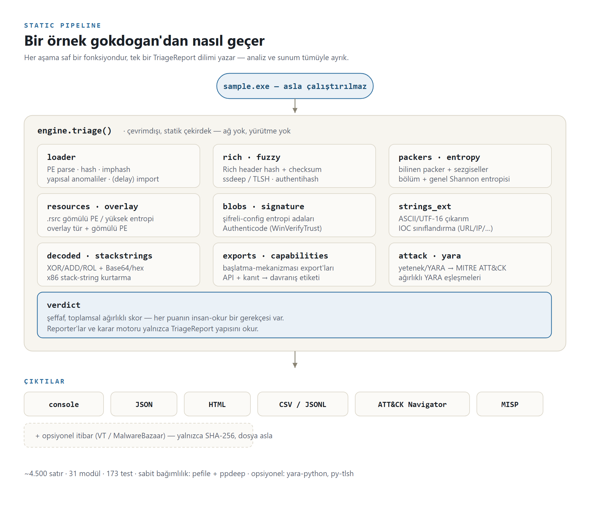
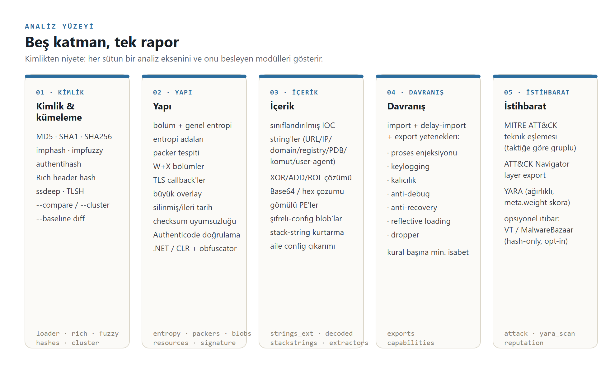
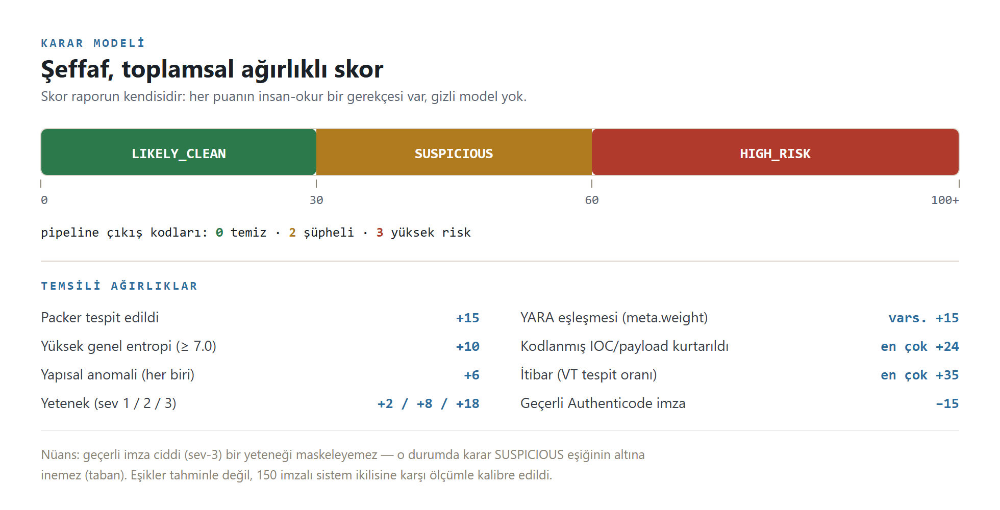

# gokdogan — Mimari Özeti

> **gökdoğan**, avcı şahin (peregrine falcon) demektir — gökyüzünün en hızlı
> avcısı. İsim yerinde: triyaj hızla, hangi örneğin tam analiz hak ettiğine
> saniyeler içinde karar vermektir. (Paket ve komut ASCII `gokdogan`.)

**Statik PE malware triyaj motoru.** Bir Windows çalıştırılabilirini alır,
örneği **hiç çalıştırmadan** statik özelliklerini çıkarır ve şeffaf, ağırlıklı
bir verdikt üretir: `LIKELY_CLEAN`, `SUSPICIOUS` veya `HIGH_RISK`.

- 31 odaklı modülde **~4.500 satır** Python
- **~1.900 satır** test · **173 test** · gerçek binary entegrasyon paketi
- Zorunlu bağımlılık: `pefile`, `ppdeep` · opsiyonel: `yara-python`, `py-tlsh`

Bu belge motorun *nasıl ve neden* böyle kurulduğunu anlatır. Kullanım için
[README.md](README.md).

---

## 1. Tasarım ilkeleri

Motorun tamamı, onu bir analist için doğru, hızlı ve güvenilir kılan beş karar
etrafında düzenlendi.

| İlke | Kodda karşılığı |
|---|---|
| **Saf fonksiyonlar → dataclass'lar** | Her analizci, `bytes`/`pefile.PE` üzerinde çalışıp dataclass döndüren saf bir fonksiyondur ([`models.py`](gokdogan/models.py)). Analizciler birbirini ya da çıktı formatını tanımaz. Yeni aşama eklemek = bir modül + [`engine.py`](gokdogan/engine.py)'de bir satır. |
| **Varsayılan çevrimdışı** | `triage()` çekirdeği asla ağa dokunmaz, örneği asla çalıştırmaz. Tek çevrimiçi özellik (reputation) opt-in, yalnızca-hash ve CLI katmanındadır — böylece analiz çekirdeği air-gapped bir malware iş istasyonunda güvenlidir. |
| **Denetlenebilir verdikt** | Skorun kendisi rapordur: her puan okunur bir gerekçe taşır ([`verdict.py`](gokdogan/verdict.py)). Analistin itiraz edemeyeceği gizli bir model yoktur. |
| **Yanlış-pozitife karşı kalibre** | Eşikler, tahminle değil, stok imzalı Windows binary'lerine karşı ampirik olarak ayarlandı. Capability kuralları minimum sayıda farklı API isabeti ister; entropi adaları yalnızca yazılabilir bölümlerde tetiklenir; sıkıştırılmış ikon kaynakları beyaz listededir. |
| **Zarif düşüş** | Eksik YARA, eksik kural, bozuk kaynak ağacı, çözümlenemeyen import tablosu — her biri çökme değil, raporda bir nota dönüşür. |

---

## 2. Boru hattı

<p align="center">
  
</p>

```
                          ┌──────────────────────────────────────────────┐
   sample.exe  ─────────▶ │                 engine.triage()              │
   (çalıştırılmaz)        │                                              │
                          │  loader ─ hashler, imphash, section,         │
                          │           anomali, import, delay-import      │
                          │  rich   ─ araç zinciri hash + checksum        │
                          │  fuzzy  ─ ssdeep / TLSH                       │
                          │  packers ─ bilinen isim + sezgisel           │
                          │  resources ─ gömülü PE, yüksek entropi        │
                          │  blobs  ─ şifreli-config entropi adaları     │
                          │  strings_ext ─ sınıflandırılmış IOC string   │
                          │  decoded ─ XOR/ADD/ROL/base64/hex kurtarma    │
                          │  exports ─ fırlatma mekanizması export'ları  │
                          │  capabilities ─ API+kanıt → davranış etiketi │
                          │  attack ─ capability/YARA → MITRE ATT&CK      │
                          │  yara   ─ ağırlıklı kural eşleşmeleri        │
                          │  verdict ─ şeffaf ağırlıklı skor             │
                          └───────────────────────┬──────────────────────┘
                                                  ▼
      konsol · JSON · HTML · CSV/JSONL · ATT&CK Navigator layer   (+ opt-in reputation)
```

Her aşama bir `TriageReport`'un tek bir dilimini yazar; raporlayıcılar ve
verdikt motoru yalnızca bu yapıyı okur. Sunum ve analiz tamamen ayrıktır.

---

## 3. Modül haritası (31 modül, katmana göre)

**Çekirdek**
- [`engine.py`](gokdogan/engine.py) — orkestratör; tüm `triage()` boru hattı
- [`models.py`](gokdogan/models.py) — her aşamanın paylaştığı dataclass'lar
- [`loader.py`](gokdogan/loader.py) — PE parse, hashler, imphash, yapısal anomaliler, (delay-)import

**Kimlik & kümeleme**
- [`fuzzy.py`](gokdogan/fuzzy.py) — ssdeep + opsiyonel TLSH; `--compare` benzerlik
- [`rich.py`](gokdogan/rich.py) — Rich header hash, `@comp.id` çözümleme, checksum-kurcalama tespiti
- [`hashes.py`](gokdogan/hashes.py) — authentihash (imza-bağımsız) + impfuzzy import hash
- [`cluster.py`](gokdogan/cluster.py) — `--cluster` union-find ile dropzone gruplama
- [`baseline.py`](gokdogan/baseline.py) — `--baseline` bilinen-iyi referansla diff

**Yapı**
- [`entropy.py`](gokdogan/entropy.py) — Shannon entropi + eşikler
- [`packers.py`](gokdogan/packers.py) — bilinen packer bölümleri + yapısal sezgiseller
- [`blobs.py`](gokdogan/blobs.py) — şifreli-config entropi adaları
- [`resources.py`](gokdogan/resources.py) — `.rsrc` gezici: gömülü PE, yüksek-entropi blob
- [`overlay.py`](gokdogan/overlay.py) — overlay içeriği: magic-byte tip, entropi, gömülü PE
- [`signature.py`](gokdogan/signature.py) — Authenticode doğrulama (WinVerifyTrust) + sertifika adları
- [`dotnet.py`](gokdogan/dotnet.py) — managed/.NET CLR-header tespiti + obfuscator parmak izleri

**İçerik**
- [`strings_ext.py`](gokdogan/strings_ext.py) — ASCII/UTF-16LE çıkarma + IOC sınıflandırma
- [`decoded.py`](gokdogan/decoded.py) — FLOSS-lite: XOR/ADD/ROL/base64/hex string kurtarma
- [`stackstrings.py`](gokdogan/stackstrings.py) — desen-tabanlı x86 stack-string kurtarma (emülatörsüz)
- [`extractors.py`](gokdogan/extractors.py) — aile config çıkarımı (Discord/Telegram/stager URL)

**Davranış & istihbarat**
- [`exports.py`](gokdogan/exports.py) — export tablosu + fırlatma mekanizması tespiti
- [`capabilities.py`](gokdogan/capabilities.py) — API/kanıt → davranış etiketi (capa tarzı)
- [`attack.py`](gokdogan/attack.py) — capability/YARA → MITRE ATT&CK + Navigator layer
- [`yara_scan.py`](gokdogan/yara_scan.py) — opsiyonel yara-python entegrasyonu
- [`reputation.py`](gokdogan/reputation.py) — opt-in VirusTotal / MalwareBazaar hash lookup

**Verdikt & raporlama**
- [`verdict.py`](gokdogan/verdict.py) — şeffaf ağırlıklı skorlama
- [`report.py`](gokdogan/report.py) — ANSI konsol + JSON
- [`html_report.py`](gokdogan/html_report.py) — tek dosya, escape'li, tema-duyarlı HTML
- [`summary.py`](gokdogan/summary.py) — batch CSV/JSONL için sample başına düz satır
- [`misp.py`](gokdogan/misp.py) — threat-intel paylaşımı için MISP event export
- [`web.py`](gokdogan/web.py) — opsiyonel FastAPI upload-and-triage servisi
- [`cli.py`](gokdogan/cli.py) — argparse CLI, çıkış kodları, çıktı yönlendirme

---

## 4. Analiz yüzeyi

<p align="center">
  
</p>

| Eksen | Sinyaller |
|---|---|
| **Kimlik / kümeleme** | MD5·SHA1·SHA256, imphash, Rich-header hash, ssdeep, TLSH |
| **Yapı** | bölüm + genel entropi, entropi adaları, packer tespiti, W+X bölümler, TLS callback, aşırı overlay, silinmiş/gelecek timestamp, checksum uyuşmazlığı |
| **İçerik** | sınıflandırılmış IOC string (URL/IP/domain/registry/PDB/komut/UA), XOR/ADD/ROL/base64/hex-kurtarılmış string, gömülü PE, şifreli-config blob |
| **Davranış** | import + delay-import + export capability'leri (injection, keylogging, persistence, anti-debug, anti-recovery, reflective-loading, dropper, …) minimum isabet sayısıyla |
| **İstihbarat** | MITRE ATT&CK teknik eşlemesi (taktik bazlı), YARA, opt-in reputation |

---

## 5. Mühendislik öne çıkanları

Bunlar bir kütüphaneyi birbirine bağlamanın ötesine geçen kararlar — bir
mülakatta anlatmaya değer kısımlar.

**Kodlu string'ler için anahtar-bağımsız komşuluk araması.** 800 KB'lık bir
DLL'de 255 tek-bayt anahtarı × anchor'ları tüm binary üzerinde brute-force
etmek ~2,4 sn sürüyordu. İçgörü: herhangi bir tek-bayt XOR/ADD altında
`encoded[i] ⊕ encoded[i-1]` **anahtardan bağımsızdır**. Tamponu bir kez
dönüştürmek (XOR için bigint kaydırma, C hızında) anahtar tespitini anchor
başına tek bir substring aramasına indirger — **2.440 ms → 133 ms**, tam
kapsam korunarak. ([`decoded.py`](gokdogan/decoded.py))

**Entropi varsayılmadı, ölçüldü.** 256 baytlık pencere rastgeleliği ölçmek
için çok küçüktür: gerçek rastgele veri orada ortalama yalnızca ~7,17 bit
verir (küçük-örneklem yanlılığı), eşik sessizce ulaşılamaz hale gelir.
Dağılımı ölçmek 512 baytlık pencereye (rastgele ≈ 7,5+) ve 7,4 eşiğine
götürdü. ([`blobs.py`](gokdogan/blobs.py))

**Yanlış-pozitifler el sallamayla değil kalibrasyonla giderildi.** Config-blob
tespiti 150 stok imzalı sistem binary'sinde tarandı; salt-okunur `.rdata`
meşru olarak yüksek-entropili sertifika verisi taşır, bu yüzden tarama
yazılabilir bölümlerle sınırlandı → **0 yanlış-pozitif**. Aynı disiplin kaynak
gezicide sıkıştırılmış PNG ikonları beyaz listeler ve bir capability
tetiklenmeden önce minimum farklı API isabeti ister.

**Aracın kendisinin güvenliği.** Malware string'leri markup içerebilir; HTML
raporu her sample-türevli değeri `html.escape`'ten geçirir, böylece bir rapor
açıldığında gömülü bir `<script>` asla çalışmaz — testle doğrulandı.
([`html_report.py`](gokdogan/html_report.py))

**Çevrimdışı çekirdek, opt-in egress.** Reputation tek ağ özelliğidir.
Varsayılan kapalıdır, yalnızca SHA-256 gönderir (asla dosya), anahtarsız
çalışmayı reddeder (böylece kazara hash sızdırmaz) ve CLI katmanında eklenir —
`triage()` motoru kanıtlanabilir şekilde çevrimdışı kalır.
([`reputation.py`](gokdogan/reputation.py))

---

## 6. Verdikt modeli

<p align="center">
  
</p>

Skorlama bilinçli olarak şeffaf ve toplamsaldır. Temsili ağırlıklar:

| Sinyal | Puan |
|---|---|
| Packer tespit edildi | +15 |
| Yüksek genel entropi (≥ 7,0) | +10 |
| Her yapısal anomali | +6 |
| Capability (şiddet 1 / 2 / 3) | +2 / +8 / +18 |
| YARA eşleşmesi | kural `meta.weight`, varsayılan +15 |
| Kurtarılmış kodlu IOC/payload | +24'e kadar |
| Gömülü Authenticode imzası (doğrulanmamış) | −8 |

Eşikler: **`SUSPICIOUS` ≥ 30**, **`HIGH_RISK` ≥ 60**. Tam döküm her raporda
basılır — analist bir örneğin neden o skoru aldığını tam olarak görür ve YARA
kuralları sezgiselleri geçersiz kılmak için kendi ağırlığını ekleyebilir.

Boru hattı dostu çıkış kodları: `0` temiz · `2` şüpheli · `3` yüksek risk.

---

## 7. Test

**173 test / ~1.900 satır.** Birim testleri her analizciyi sentetik girdilerle
izole eder (elle üretilmiş XOR/base64 payload'ları, sahte PE tamponları,
ekilmiş entropi adaları). Entegrasyon paketi tüm boru hattını gerçek sistem
binary'lerine (`notepad.exe`, `kernel32.dll`, `mmc.exe`) karşı çalıştırır ve
stok Microsoft binary'lerinin asla `HIGH_RISK` almadığını, dropper /
gömülü-config / hayali-string yanlış-pozitiflerine takılmadığını doğrular. Ağ
kodu enjekte HTTP mock'larıyla test edilir — gerçek dış çağrı yoktur.

---

## 8. Teknoloji yığını

Python 3.12 · `pefile` (PE parse) · `ppdeep` (saf-Python ssdeep) · opsiyonel
`yara-python`, `py-tlsh` · reputation için standart kütüphane `urllib`. Web
framework yok, ağır bağımlılık yok — malware-lab akışına giren, kendi kendine
yeten bir CLI.

---

*gokdogan yalnızca statik triyaj yapar. Örneği asla çalıştırmaz ve verdikti
kesin bir sınıflandırma değil, bir önceliklendirme sinyalidir. Gerçek
malware'i izole bir analiz VM'inde ele alın.*
