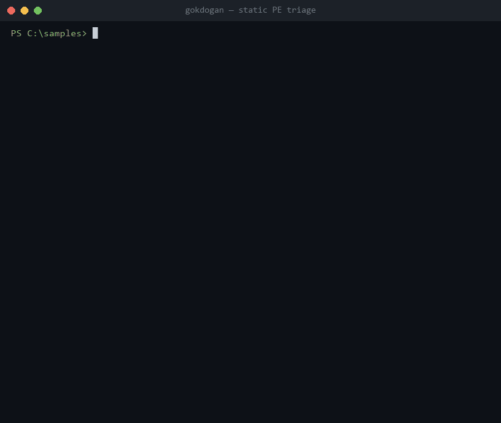
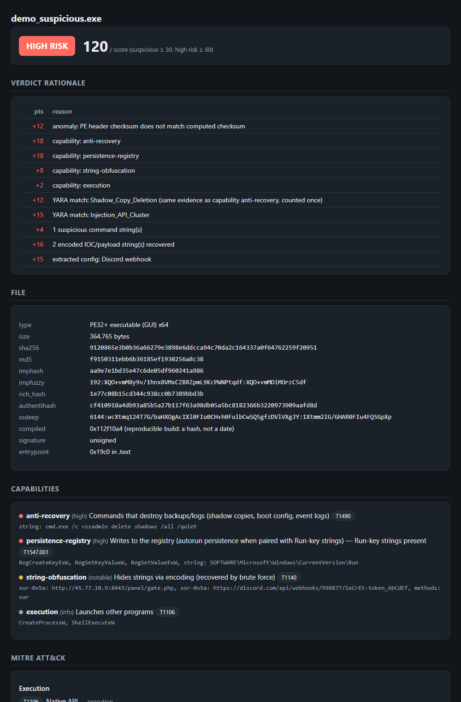

# gokdogan 🦅

[](https://github.com/IlkerUnver00/gokdogan-triage/actions/workflows/ci.yml)
[](https://github.com/IlkerUnver00/gokdogan-triage/releases)
[](https://pypi.org/project/gokdogan-triage/)
[](https://www.python.org/)
[](https://docs.astral.sh/ruff/)
[](#license)

**Static PE malware triage engine.** Feed it a Windows executable; it extracts
static features — hashes, imphash, per-section entropy, packer artifacts,
classified strings, import-based capability tags, YARA matches — and produces a
transparent, weighted triage verdict: `LIKELY_CLEAN`, `SUSPICIOUS`, or `HIGH_RISK`.

**gökdoğan** is Turkish for the *peregrine falcon* — the fastest hunter in the
sky. A fitting name: triage is about speed, deciding in seconds which samples
deserve a full analyst's attention. (The package and command are the ASCII
`gokdogan`.)

> ⚠️ **Triage, not conviction.** gokdogan never executes the sample and its
> verdict is a prioritization signal, not a definitive classification. Handle
> real malware only inside an isolated analysis VM.

> 📐 **Architecture:** [ARCHITECTURE.md](ARCHITECTURE.md) (English) ·
> [MIMARI.md](MIMARI.md) (Türkçe) ·
> **[live visual page ↗](https://ilkerunver00.github.io/gokdogan-triage/)**
> ([source](docs/index.html)) · [changelog](CHANGELOG.md)

<p align="center">
  
  <br>
  <em>Static triage of a network-free
  <a href="examples/make_demo_sample.py">demo sample</a>: hashes, capabilities,
  MITRE ATT&amp;CK, recovered C2, and a transparent weighted verdict — the
  sample is never executed.</em>
</p>

## What it does

```text
            ┌────────────────────────────────────────────────┐
            │                  gokdogan                     │
 sample.exe │  ┌──────────┐  ┌─────────┐  ┌──────────────┐   │
 ──────────▶│  │ loader   │─▶│ packers │  │ strings_ext  │   │
            │  │ pefile   │  │ entropy │  │ classifier   │   │
            │  └────┬─────┘  └────┬────┘  └──────┬───────┘   │
            │       │             │              │           │
            │       ▼             ▼              ▼           │
            │  ┌──────────────────────────────────────────┐  │
            │  │ capabilities (API → behavior)  +  YARA   │  │
            │  └───────────────────┬──────────────────────┘  │
            │                      ▼                         │
            │            verdict (weighted score)            │
            └──────────────────────┬─────────────────────────┘
                                   ▼
                     console report  +  JSON export
```

| Stage | Signal | Why it matters in triage |
|---|---|---|
| **Hashing** | MD5/SHA1/SHA256 + **imphash** + **impfuzzy** + **authentihash** | imphash/impfuzzy cluster by import table; authentihash matches re-signed / signed-vs-unsigned copies of the same binary |
| **Fuzzy hashing** | **ssdeep** + optional **TLSH** | similarity-preserving: two builds of the same malware score as related even when every crypto hash differs; `--compare` scores a sample against a reference |
| **Clustering** | `--cluster` groups a dropzone by shared hashes / fuzzy similarity; `--baseline` diffs a sample against a known-good reference | work a folder family-by-family, or answer "is this the real X or a trojanized X?" |
| **Managed (.NET)** | CLR-header detection: runtime version, flags, obfuscator fingerprints | flags that a sample is .NET (import-based capabilities are blind to managed code) and spots ConfuserEx / .NET Reactor / SmartAssembly |
| **Rich header** | toolchain **rich_hash** + decoded `@comp.id` entries + checksum validation | fingerprints the exact build environment (more specific than imphash); a bad checksum means a forged/copied header — an anti-clustering tell |
| **Resource walker** | enumerates `.rsrc`, hashes each leaf, flags **embedded PEs** and **high-entropy blobs** | the dropper/packer's favourite hiding spot; compressed media (PNG, JPEG, GIF, audio, fonts) is recognised by its header and exempt, while archives (ZIP, CAB, 7z, …) stay flagged, since a compressed second stage is what a dropper carries |
| **Export table** | DLL name, named/ordinal counts, forwarders, launch-mechanism exports (`ReflectiveLoader`, `DllRegisterServer`, `ServiceMain`) | tells you how a DLL expects to be run — reflective beacon, `regsvr32` target, or service host |
| **Delay-load imports** | lazily-resolved imports, **merged into capability analysis** | APIs hidden in the delay-load table (network, injection) still light up their capability tags |
| **Entropy** | Shannon entropy per section + overall | executable code sits ~6 bits/byte; ≥7.2 means compressed/encrypted content |
| **Packer detection** | known section names (UPX, VMProtect, Themida, …) + structural heuristics | packing is the single cheapest evasion; heuristics survive renamed sections |
| **Anomalies** | W+X sections, TLS callbacks, wiped or impossible timestamps, missing imports, oversized overlay, bad checksum | things real compilers rarely produce; a reproducible build (`/Brepro`) stores a hash where the time would be, so its stamp is shown as a hash, not flagged |
| **Authenticode** | real signature **verification** via Windows `WinVerifyTrust` (offline) + signer/issuer names | distinguishes a *valid* signature from a **tampered** one (digest mismatch = modified after signing), expired, or untrusted-root — a strong trojanized-binary tell |
| **Strings** | ASCII + UTF-16LE extraction, regex classification (URL, IP, domain, registry, PDB path, user-agent, suspicious command invocation, bare LOLBin name) | fastest source of IOCs and intent; CA/vendor noise is filtered out. A command counts when the invocation is suspicious (`powershell -enc`, `certutil -urlcache`, `vssadmin delete shadows`, …); a tool merely named (`rundll32.exe`) is shown but not scored |
| **Encoded strings (FLOSS-lite)** | brute-force **single-byte XOR/ADD/ROL** + **Base64/hex** recovery of hidden IOCs and embedded PEs | surfaces the C2/commands malware encodes to dodge a plain `strings` pass — via a fast key-invariant adjacency search, not code emulation |
| **Config blobs** | **entropy islands** — localized high-entropy regions inside calm writable sections | spots an encrypted config/staged payload hiding in `.data` without decrypting it; read-only `.rdata` cert data is excluded so clean binaries stay quiet |
| **Capabilities** | import table → behavior tags (`process-injection`, `keylogging`, `anti-recovery`, …), capa-style with per-rule minimum hit counts, and specific APIs required where generic ones are linked by every program | tells the analyst *what it could do* without running it |
| **ATT&CK mapping** | capabilities + YARA rules → MITRE ATT&CK techniques, grouped by tactic in kill-chain order | speaks the language of detections, reports, and threat intel |
| **YARA** | bundled + user-supplied rules; `meta.weight` feeds the score directly, `meta.attack` feeds the ATT&CK summary, `meta.overlaps` names a capability read from the same evidence so one fact is not counted twice | drop your team's rules in and they participate in the verdict |
| **Verdict** | transparent weighted score with a printed breakdown | every point has a reason — the analyst can argue with it |
| **Reporting** | ANSI console, JSON, **self-contained HTML** (verdict rationale embedded), CSV/JSONL batch, ATT&CK Navigator layer, **MISP event** | one engine, many outputs — terminal for triage, HTML for the case file, CSV for the dropzone, JSON for the pipeline, MISP for threat-intel sharing |
| **Reputation** (opt-in) | VirusTotal + MalwareBazaar **hash-only** lookup, off by default | "is this already known?" without uploading the sample — only the SHA-256 leaves, and only when you pass `--reputation` with a key |

<p align="center">
  
</p>

*The full pipeline — plus the [analysis surface](assets/analysis-layers.png) and
[verdict model](assets/verdict-model.png) diagrams — is walked through in
[ARCHITECTURE.md](ARCHITECTURE.md) (English) · [MIMARI.md](MIMARI.md) (Türkçe).*

## Install

### On any Windows PC — no Python needed

Grab a binary from the [Releases](https://github.com/IlkerUnver00/gokdogan-triage/releases) page:

- **`gokdogan-setup.exe`** — installer. Per-user (no admin prompt), optionally
  adds `gokdogan` to your PATH, registers an uninstaller.
- **`gokdogan.exe`** — standalone single-file CLI. Copy it anywhere and run it.

Both embed Python, every dependency, and the bundled YARA rules. Build them
yourself with `.\packaging\build_exe.ps1` (PyInstaller) and
`ISCC.exe packaging\gokdogan.iss` (Inno Setup); pushing a `v*` tag builds and
attaches both to a GitHub Release automatically.

### From PyPI

If you already have Python 3.10+, install the published package:

```bash
pip install gokdogan-triage
```

This pulls the pure-Python core (`pefile`, `ppdeep`) and the bundled YARA
rules, and puts the `gokdogan` command on your PATH. Add optional extras when
you want them:

```bash
pip install "gokdogan-triage[yara]"   # yara-python — activates the YARA stage
pip install "gokdogan-triage[tlsh]"   # TLSH fuzzy hashing (needs a C++ compiler)
pip install "gokdogan-triage[web]"    # FastAPI upload-and-triage service
```

### From source

```bash
pip install -e .[dev]
```

Hard dependencies are `pefile` and `ppdeep` (pure-Python ssdeep — no C
toolchain). Optional: `yara-python` for the YARA stage and `py-tlsh` for
TLSH fuzzy hashing — each degrades to a note in the report when absent.

```bash
pip install -e .[dev,tlsh]   # include TLSH (needs a C++ compiler)
```

Or run it in a container (no host Python needed):

```bash
docker build -t gokdogan .
docker run --rm -v "$PWD/samples:/samples:ro" gokdogan /samples/suspect.exe
```

The bundled YARA rules ship inside the package, so `gokdogan` works out of
the box; point `--rules` at your own directory to add your team's rules.

Prefer a browser? Run the optional upload-and-triage web service (drop a PE,
get the HTML report; `POST /api/triage` returns JSON):

```bash
pip install -e ".[web]"
uvicorn gokdogan.web:app --host 127.0.0.1 --port 8000
```

## Usage

```bash
# full report for one sample
gokdogan sample.exe

# scan a directory, one summary line per file
gokdogan C:\samples --quiet

# JSON for pipelines (SOAR, sandbox pre-filter, …)
gokdogan sample.exe --json report.json

# self-contained HTML report to attach to a case (verdict rationale embedded)
gokdogan sample.exe --html report.html

# MITRE ATT&CK Navigator layer — load it at
# https://mitre-attack.github.io/attack-navigator/ to see the sample's
# techniques highlighted on the matrix, shaded by triage confidence
gokdogan sample.exe --attack-layer sample.attack.json

# fuzzy-compare a sample against a known reference (clustering)
gokdogan suspect.exe --compare known_stealer.exe

# batch-triage a whole dropzone into one sortable table
gokdogan C:\dropzone --csv triage.csv
gokdogan C:\dropzone --jsonl triage.jsonl     # one JSON object per line, SIEM-ready

# cluster a dropzone into families, or diff against a known-good binary
gokdogan C:\dropzone --cluster
gokdogan suspect_svchost.exe --baseline C:\Windows\System32\svchost.exe

# share findings as a MISP event
gokdogan sample.exe --misp sample.misp.json

# your own rule set
gokdogan sample.exe --rules C:\rules\team-rules

# tuning / skips
gokdogan sample.exe --min-strlen 8   # longer minimum string length (default 6)
gokdogan sample.exe --no-yara        # skip the YARA stage
gokdogan sample.exe --no-verify-sig  # skip Authenticode verification (Windows-only)

# opt-in reputation: sends ONLY the SHA-256 (never the file) to VT/MalwareBazaar
gokdogan sample.exe --reputation --vt-key $VT_API_KEY
```

Reputation lookup is the **only** feature that touches the network, and it
is off unless you pass `--reputation` with an API key (`--vt-key`/`--mb-key`
or `VT_API_KEY`/`MB_API_KEY`). It sends the sample's SHA-256 only — never the
file — and prints a heads-up before any hash leaves the host. The core
`triage()` engine is always fully offline.

In batch mode gokdogan prints one line per sample plus a final tally
(`N file(s): X high-risk, Y suspicious, Z clean`) and writes a flat
summary row per file — verdict, score, imphash/rich_hash/ssdeep (for
clustering), capabilities, ATT&CK techniques, YARA hits, and counts of
embedded PEs / encoded strings / config blobs / anomalies. Sort the CSV by
score to work a dropzone worst-first, or group by imphash/rich_hash to
cluster variants.

Exit codes are pipeline-friendly: `0` clean, `2` suspicious, `3` high risk —
so `gokdogan dropzone/ --quiet && echo OK` works as a gate.

### Sample output

```text
gokdogan triage report — invoice_scan.exe

── File ──────────────────────────────────────────────────
  type       : PE32 executable (GUI) x86
  imphash    : 09d0478591d4f788cb3e5ea416c25237
  rich_hash  : 1e77c08b15cd344c938cc0b7389bbd3b
  ssdeep     : 6144:wYXtmo124T7G/baHXOgAcIXl0FIu0CH+h0FuiiCwSQ5gf:NXtmk2IG/GHAR0FIu7FQ5G
  compiled   : 2031-01-04 11:20:41 UTC  [compile timestamp is in the future]
  signed     : no

── Packer ────────────────────────────────────────────────
  DETECTED: UPX
    - section name 'UPX0' is a known UPX artifact
    - executable section 'UPX1' has entropy 7.91 (>= 7.2)

── Capabilities ──────────────────────────────────────────
  [!!!] process-injection      Writes and executes code in other processes  (T1055)
        CreateRemoteThread, VirtualAllocEx, WriteProcessMemory
  [!!!] keylogging             Captures keystrokes  (T1056.001)
        GetAsyncKeyState, SetWindowsHookExW

── MITRE ATT&CK ──────────────────────────────────────────
  Defense Evasion
    T1055       Process Injection
                from: process-injection, yara:Injection_API_Cluster
  Collection
    T1056.001   Input Capture: Keylogging
                from: keylogging
  Impact
    T1490       Inhibit System Recovery
                from: anti-recovery, yara:Shadow_Copy_Deletion

── Verdict ───────────────────────────────────────────────
  +15  packer detected: UPX
  +18  capability: process-injection
  +18  capability: keylogging
   +5  compile timestamp is in the future
  ...
  HIGH RISK  (score 74, thresholds: suspicious ≥ 30, high risk ≥ 60)
```

The same triage rendered as a self-contained HTML case file (`--html`):

<p align="center">
  
</p>

## Project layout

```text
gokdogan/
├── gokdogan/
│   ├── engine.py         # orchestrator: triage() pipeline
│   ├── loader.py         # PE parsing, hashes, imphash, anomalies
│   ├── rich.py          # Rich header hash, @comp.id decode, checksum check
│   ├── resources.py      # .rsrc walker: embedded PEs, high-entropy blobs
│   ├── fuzzy.py          # ssdeep + optional TLSH fuzzy hashing / compare
│   ├── entropy.py        # Shannon entropy + thresholds
│   ├── packers.py        # known-section-name table + heuristics
│   ├── strings_ext.py    # ASCII/UTF-16LE extraction + classification
│   ├── decoded.py        # FLOSS-lite: XOR/ADD/ROL/Base64/hex string recovery
│   ├── blobs.py          # config-blob spotting: entropy islands in .data
│   ├── exports.py        # export table + launch-mechanism export detection
│   ├── capabilities.py   # API → behavior rule table (capa-style)
│   ├── attack.py         # capability/YARA → MITRE ATT&CK technique mapping
│   ├── yara_scan.py      # optional yara-python integration
│   ├── verdict.py        # weighted scoring, thresholds
│   ├── models.py         # dataclasses shared by all stages
│   ├── report.py         # ANSI console + JSON renderers
│   ├── html_report.py    # self-contained HTML report (escaped, theme-aware)
│   ├── reputation.py     # opt-in VirusTotal / MalwareBazaar hash lookup
│   ├── summary.py        # flat per-sample rows for batch CSV/JSONL
│   ├── cli.py            # argparse CLI, exit codes
│   ├── web.py            # optional FastAPI upload-and-triage service
│   └── rules/            # bundled starter YARA rules (packaged with the wheel)
├── scripts/
│   └── benign_sweep.py   # false-positive benchmark over installed PE files
└── tests/                # pytest: unit per module, e2e on system binaries,
                          # detection guard (tests/archetypes.py)
```

## Design notes

- **Every stage is a pure function over `bytes`/`pefile.PE` → dataclasses.**
  Analyzers don't know about each other or about the output format, so adding
  a stage (e.g. rich-header hashing) means one module + one line in `engine.py`.
- **Capability rules need specific evidence, not just a count.**
  `IsDebuggerPresent`, `GetTickCount` and `QueryPerformanceCounter` are linked
  into every MSVC program, so even together they do not light up `anti-debug`;
  that takes `CheckRemoteDebuggerPresent` or `NtQueryInformationProcess`.
  `keylogging` needs a capture mechanism (a hook, async polling or raw input)
  plus a second one, a keyboard-state read or a key-to-character translation.
  This is the difference between a tag an analyst trusts and alert fatigue.
- **The verdict is auditable by construction.** The score breakdown *is* the
  report; there is no hidden model. YARA rules can inject their own weight via
  `meta.weight`, so a team's high-confidence family rules can outvote heuristics.
- **One fact counts once.** Packing signals are capped together; a YARA rule
  that reads the same strings as a capability adds only what exceeds it; in a
  program importing 200 or more functions, the common behaviour tags (network,
  crypto, registry, …) are capped together, because a program that large has
  them all. Each rule was priced on benign software with
  [`scripts/benign_sweep.py`](scripts/benign_sweep.py) before it went in.
- **Graceful degradation**: no yara-python, no rules dir, unparseable imports —
  each degrades to a note in the report instead of a crash.
- **Offline by default.** The `triage()` engine never touches the network;
  the sample is never executed. The single online feature (reputation) is
  opt-in, hash-only, and lives in the CLI layer — so the analysis core stays
  safe to run on an air-gapped malware workstation.

## Roadmap

- [x] **v0.1 — core engine** (this repo)
  - [x] PE parsing, hashes, imphash, section entropy
  - [x] packer detection (known names + heuristics)
  - [x] structural anomaly checks (W+X, TLS callbacks, overlay, timestamps)
  - [x] string extraction (ASCII + UTF-16LE) and IOC classification
  - [x] capa-style capability tagging from the import table
  - [x] MITRE ATT&CK technique mapping (capabilities + YARA `meta.attack`), grouped by tactic
  - [x] ATT&CK Navigator layer export (`--attack-layer`), shaded by triage confidence
  - [x] YARA integration with score-weighted rules
  - [x] transparent weighted verdict + ANSI/JSON reports
  - [x] pytest suite incl. e2e against known-benign system binaries
- [ ] **v0.2 — better clustering**
  - [x] TLSH/ssdeep fuzzy hashing + `--compare` similarity scoring
  - [x] Rich header hash, `@comp.id` toolchain decode, and checksum-tamper detection
  - [x] resource walker: embedded PEs in `.rsrc`, high-entropy blobs, dropper tagging
  - [x] export table analysis + delay-load imports merged into capabilities
  - [x] `--baseline` mode: diff a sample against a known-good reference
- [ ] **v0.3 — deeper strings**
  - [x] single-byte XOR/ADD/ROL encoded-string recovery (FLOSS-lite), key-invariant adjacency search
  - [x] Base64 + hex blob detection and decode (IOCs and embedded PEs)
  - [x] config-blob spotting: entropy islands inside calm writable sections
  - [ ] true stack-string recovery (needs lightweight code emulation)
- [ ] **v0.4 — lab integration**
  - [x] batch mode with CSV/JSONL summary for a whole dropzone
  - [x] self-contained HTML report with embedded verdict rationale
  - [x] VirusTotal / MalwareBazaar hash lookup (opt-in, hash-only)
- [ ] **v0.5 — depth & interoperability**
  - [x] Authenticode signature verification (`WinVerifyTrust`) + certificate details
  - [x] overlay content analysis (embedded archives / PEs)
  - [x] managed (.NET) detection: CLR header, flags, obfuscator fingerprints
  - [x] extra clustering hashes (authentihash, impfuzzy) + `--cluster` / `--baseline`
  - [x] MISP event export (`--misp`) for threat-intel sharing
  - [x] ruff lint + coverage in CI
  - [x] pattern-based stack-string recovery (no emulator dependency)
  - [x] pluggable family config extractors (Discord/Telegram/stager URLs)
  - [x] FastAPI upload-and-triage service; wheel-packaged rules + Dockerfile
- [ ] **v0.6 — measured accuracy**
  - [x] benign false-positive benchmark (`scripts/benign_sweep.py`) with a held-out check
  - [x] calibration against it: specific-API rules, one fact counted once,
        size-aware capability cap, reproducible-build timestamps
  - [x] detection guard: synthetic malware-shaped reports keep their verdicts
  - [ ] recall on a labelled malware corpus (isolated lab)
  - [ ] a second machine and software mix for the false-positive rate

## What gokdogan does not do

gokdogan is a fast first-pass triage layer. It does not replace the tools
analysts already rely on, and its edges are worth stating plainly:

- **Static only.** It never runs the sample, so anything visible only at
  runtime (unpacked payloads, decrypted configs, network behaviour) is out of
  reach. Packing signals are capped at the `SUSPICIOUS` threshold, so packing
  alone can raise a sample to `SUSPICIOUS` at most, never to `HIGH_RISK`; what
  the packed payload does is not analysed. For behaviour, use a sandbox such
  as CAPE.
- **Not capa.** Capabilities come from import-table and string evidence with
  minimum hit counts, not from capa's rule engine over disassembled code. capa
  sees far more: function-level features, .NET metadata, sandbox reports.
- **Not FLOSS.** Encoded-string recovery covers single-byte XOR/ADD/ROL,
  Base64/hex and simple stack strings. It does not emulate decoding routines
  the way FLOSS does.
- **Not Detect It Easy or PEStudio.** Packer and compiler identification is
  shallower than DIE's signature database, and PEStudio shows more indicators
  interactively.
- **.NET is a blind spot.** Managed assemblies and common obfuscators are
  detected, but import-based capability analysis sees nothing inside managed
  code.
- **False positives are measured on one machine; recall is not measured.**
  [`scripts/benign_sweep.py`](scripts/benign_sweep.py) triages installed PE
  files and counts every verdict above `LIKELY_CLEAN` as a false positive
  (installed software is assumed benign; nothing was checked against a
  reputation service). On one Windows 11 workstation it drew a random sample
  of files up to 12 MB under `System32`, `Program Files` and
  `Program Files (x86)`, and the rules in this release were tuned on those
  files: on the 2,887 still on disk, v0.5.2 flagged 11.8% `SUSPICIOUS` or
  worse and 1.9% `HIGH_RISK`, this release 2.0% and 0.1%. Those numbers
  flatter the engine, because the rules were fitted to the same files. The estimate to
  quote comes from a second sample of 2,694 other files from the same
  machine that played no part in tuning: v0.5.2 12.7% / 2.2%, this release
  2.2% / 0.15% (59 and 4 files; 95% interval for the first 1.7–2.8%). On
  native PE files, which the import-based rules actually analyse, it is
  3.0% (v0.5.2: 17.7%); 29% of the files are .NET assemblies.
  The machine is not a typical workload: most third-party files come from
  two forensic suites, installers are almost absent, and files over 12 MB
  were not scanned. Recall on real malware has not been measured: the test
  suite only checks that synthetic malware-shaped reports keep their
  verdicts through tuning. Treat the verdict as a prioritisation signal.
- **Padding the import table buys the size cap.** Common capability tags
  are capped in programs that import 200 or more distinct functions, because
  that is where benign software stacks them. A sample that links 200 real
  functions gets the cap too; duplicate and delay-load entries do not count,
  and severity-3 tags (injection, keylogging, download-and-execute, dropper)
  always count in full.
- **Signature verification is Windows-only.** Elsewhere the Authenticode
  status is `unavailable`, so the same file can score differently.
- **Certificate-table checks are deliberately strict.** Anything in the
  Authenticode certificate table beyond the signature itself (16 bytes or
  more) is reported and cancels the signature credit, including a second,
  non-signature entry a vendor put there on purpose. One legitimate forensics
  DLL tested carries 512 such bytes. Data hidden inside the signature's own
  unauthenticated attributes is not inspected.
- **Not a platform.** For queues, dozens of file formats and multi-engine
  pipelines, use AssemblyLine, Strelka or Karton/MWDB. gokdogan is one CLI.

## Testing

```bash
pytest -v
```

256 tests: unit tests cover each analyzer in isolation with synthetic
inputs. The integration suite runs the full pipeline against real system
binaries (`notepad.exe`, `kernel32.dll`, `mmc.exe` and, where installed, a
signed `chrome.exe`) and asserts none scores `HIGH_RISK` or trips the
dropper / embedded-config / phantom-string false positives; at v0.5.2
`mmc.exe` and `chrome.exe` did score `HIGH_RISK` (83 and 79). The detection
guard ([`tests/archetypes.py`](tests/archetypes.py)) scores twelve
synthetic malware-shaped reports and fails if calibration lowers any of them
below the verdict v0.5.2 gave it (one documented exception).

The false-positive benchmark is a script, not part of `pytest`:

```bash
python scripts/benign_sweep.py --limit 3000 --out sweep_results/sample
```

It writes per-file results, the signals behind the flagged files and the
worst offenders to `sweep_results/` (git-ignored: the paths describe your
machine). `--paths-from` re-scores the same files with another engine
(`--engine`), and `--exclude-results` draws a held-out sample.

## License

MIT
